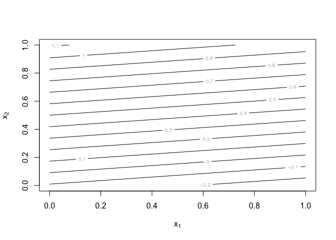
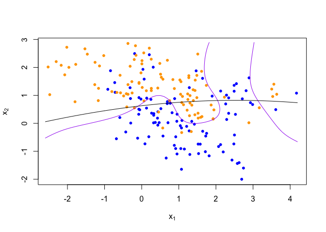
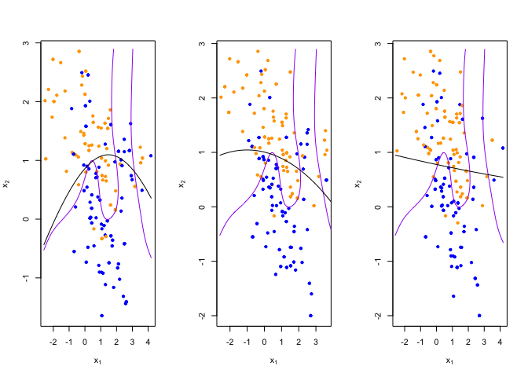
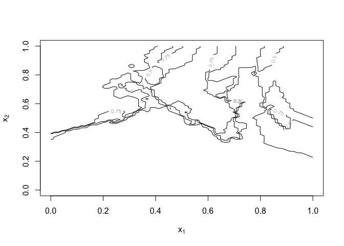
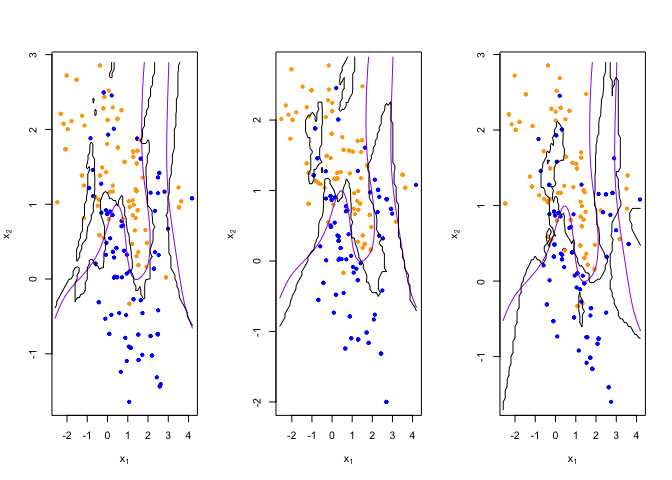

Homework 1
================
Xueyuan Li
January 18, 2020

``` r
library('class')
library('dplyr')
```

    ## 
    ## Attaching package: 'dplyr'

    ## The following objects are masked from 'package:stats':
    ## 
    ##     filter, lag

    ## The following objects are masked from 'package:base':
    ## 
    ##     intersect, setdiff, setequal, union

``` r
## load binary classification example data from author website 
## 'ElemStatLearn' package no longer available
load(url('https://web.stanford.edu/~hastie/ElemStatLearn/datasets/ESL.mixture.rda'))
dat <- ESL.mixture

#head(dat)
```

``` r
plot_mix_data <- function(dat, datboot=NULL) {
  if(!is.null(datboot)) {
    dat$x <- datboot$x
    dat$y <- datboot$y
  }
  plot(dat$x[,1], dat$x[,2],
       col=ifelse(dat$y==0, 'blue', 'orange'),
       pch=20,
       xlab=expression(x[1]),
       ylab=expression(x[2]))
  ## draw Bayes (True) classification boundary
  prob <- matrix(dat$prob, length(dat$px1), length(dat$px2))
  cont <- contourLines(dat$px1, dat$px2, prob, levels=0.5)
  rslt <- sapply(cont, lines, col='purple')
}

plot_mix_data(dat)
```

<!-- -->

### 1. Origin

``` r
## fit linear classifier
fit_lc <- function(y, x) {
  x <- cbind(1, x)
  beta <- drop(solve(t(x)%*%x)%*%t(x)%*%y)
}


## make predictions from linear classifier
predict_lc <- function(x, beta) {
  cbind(1, x) %*% beta
}


## fit model to mixture data and make predictions
lc_beta <- fit_lc(dat$y, dat$x)
lc_pred <- predict_lc(dat$xnew, lc_beta)
typeof(lc_pred)
```

    ## [1] "double"

``` r
## reshape predictions as a matrix
lc_pred <- matrix(lc_pred, length(dat$px1), length(dat$px2))
contour(lc_pred,
      xlab=expression(x[1]),
      ylab=expression(x[2]))
```

<!-- -->

``` r
## find the contours in 2D space such that lc_pred == 0.5
lc_cont <- contourLines(dat$px1, dat$px2, lc_pred, levels=0.5)

## plot data and decision surface
plot_mix_data(dat)
sapply(lc_cont, lines)
```

<!-- -->

    ## [[1]]
    ## NULL

### 1, Re-write the linear regression using lm function

``` r
training_data=data.frame(x1 = dat$x[,1],x2 = dat$x[,2],y=dat$y)
fit_lm <- function(y, x1,x2) {
  fit<-lm(y ~ x1+x2)
}
#fit_lm <- function(y, x) {
#  dat=data.frame(y=y,x=x)
#  lm(y~x1+x2, data=dat)
#}
predict_lm <- function(x, model) {
  predict(model, newdata=x)
}

## fit model to mixture data and make predictions
lc_beta_model <- 
  fit_lm(training_data$y, training_data$x1, training_data$x2)

lc_beta<-as.numeric(unlist(lc_beta_model[1]))
lc_pred <- predict_lm(dat$xnew,lc_beta_model)

## reshape predictions as a matrix
lc_pred <- matrix(lc_pred, length(dat$px1), length(dat$px2))
contour(lc_pred,
      xlab=expression(x[1]),
      ylab=expression(x[2]))
```

<!-- -->

``` r
## find the contours in 2D space such that lc_pred == 0.5
lc_cont <- contourLines(dat$px1, dat$px2, lc_pred, levels=0.5)

## plot data and decision surface
plot_mix_data(dat)
sapply(lc_cont, lines)
```

<!-- -->

    ## [[1]]
    ## NULL

------------------------------------------------------------------------

### 2, Adding squared terms for x1 and x2 to the linear model

``` r
#fit_lc<- function(lm(dat$y ~ dat$x)
training_data=data.frame(x1 = dat$x[,1],x2 = dat$x[,2],x3=(dat$x[,1])^2,x4=(dat$x[,2])^2,y=dat$y)
testing_data=data.frame(x1=dat$xnew[,1],x2=dat$xnew[,2],x3=(dat$xnew[,1])^2,x4=(dat$xnew[,2])^2)
fit_lm2 <- function(y, x1,x2,x3,x4) {
  fit<-lm(y ~ x1+x2+x3+x4)
}

predict_lm2 <- function(x, model) {
  predict(model, newdata=x)
}

## fit model to mixture data and make predictions
lc_beta_model2 <- 
  fit_lm2(training_data$y, training_data$x1, training_data$x2, training_data$x3, training_data$x4)

lc_beta2<-as.numeric(unlist(lc_beta_model2[1]))
lc_pred2 <- predict_lm(testing_data,lc_beta_model2)

## reshape predictions as a matrix
lc_pred2 <- matrix(lc_pred2, length(dat$px1), length(dat$px2))
contour(lc_pred2,
      xlab=expression(x[1]),
      ylab=expression(x[2]))
```

<!-- -->

``` r
## find the contours in 2D space such that lc_pred == 0.5
lc_cont <- contourLines(dat$px1, dat$px2, lc_pred2, levels=0.5)

## plot data and decision surface
plot_mix_data(dat)
sapply(lc_cont, lines)
```

<!-- -->

    ## [[1]]
    ## NULL

### 3, Compare different Bootstrap origin vs adding square

``` r
## do bootstrap to get a sense of variance in decision surface
resample <- function(dat) {
  idx <- sample(1:length(dat$y), replace = T)
  dat$y <- dat$y[idx]
  dat$x <- dat$x[idx,]
  return(dat)
}

# x1, x2
## plot linear classifier for three bootstraps
par(mfrow=c(1,3))
for(b in 1:3) {
  datb <- resample(dat)
  ## fit model to mixture data and make predictions
  lc_beta <- fit_lc(datb$y, datb$x)
  lc_pred <- predict_lc(datb$xnew, lc_beta)
  
  ## reshape predictions as a matrix
  lc_pred <- matrix(lc_pred, length(datb$px1), length(datb$px2))

  ## find the contours in 2D space such that lc_pred == 0.5
  lc_cont <- contourLines(datb$px1, datb$px2, lc_pred, levels=0.5)
  
  ## plot data and decision surface
  plot_mix_data(dat, datb)
  sapply(lc_cont, lines)
}
```

<!-- -->

``` r
# (2) x1,x2,x3,x4
## plot linear classifier for three bootstraps
par(mfrow=c(1,3))
for(b in 1:3) {
  datb <- resample(dat)
  
  training_data=data.frame(x1 = datb$x[,1],x2 = datb$x[,2],x3=(datb$x[,1])^2,x4=(datb$x[,2])^2,y=datb$y)
  testing_data=data.frame(x1=datb$xnew[,1],x2=datb$xnew[,2],x3=(datb$xnew[,1])^2,x4=(datb$xnew[,2])^2)
  
  lc_beta_model2 <- fit_lm2(training_data$y, training_data$x1, training_data$x2, training_data$x3, training_data$x4)
  lc_beta2<-as.numeric(unlist(lc_beta_model2[1]))
  lc_pred2 <- predict_lm(testing_data,lc_beta_model2)

  ## reshape predictions as a matrix
  lc_pred2 <- matrix(lc_pred2, length(datb$px1), length(datb$px2))
  
  ## find the contours in 2D space such that lc_pred == 0.5
  lc_cont <- contourLines(datb$px1, datb$px2, lc_pred2, levels=0.5)


  ## plot data and decision surface
  plot_mix_data(dat, datb)
  sapply(lc_cont, lines)
}
```

<!-- -->

### 4, Describe how this more flexible model affects the bias-variance trade-off

**Answer:** Models with high variance perform very well on training
data, but have high error rates on testing data. Y is a quadratic
equation of x, so the decision boundary will not be a straight line, but
a smoothing line which can more fit the model. So the variance will be
higher than before.

– what did we do that cause the model to be more flexible?

We add two squared terms for x1 and x2 to the linear model.If we compare
the errors for the training data using sum of squared errors, Without
squared terms will have a higher error on the training data. With
squared terms has very little as the line(model) fits too closes to the
training data. That will makt the model more flexible.

– what is bias?

Bias can be defined as the difference between the Predicted values and
the Expected values.

– what is variance?

Variance error is as a result of the model making too complex
assumptions.

– how about the tradeoff?

After we add two squared terms for x1 and x2, the variance is higher but
the bias is lower. It represents the model just well enough without
having too much variance or bias for both the training and testing data.

------------------------------------------------------------------------

### knn classifier

``` r
library('class')
library('dplyr')

## fit knn classifier
## use 5-NN to estimate probability of class assignment
#the training classes: cl
knn_fit <- knn(train=datb$x, test=datb$xnew, cl=datb$y, k=5, prob=TRUE)
knn_pred <- attr(knn_fit, 'prob')
knn_pred <- ifelse(knn_fit == 1, knn_pred, 1-knn_pred)

## reshape predictions as a matrix
knn_pred <- matrix(knn_pred, length(dat$px1), length(dat$px2))
contour(knn_pred,
        xlab=expression(x[1]),
        ylab=expression(x[2]),
        levels=c(0.25, 0.5, 0.75))
```

<!-- -->

``` r
## find the contours in 2D space such that knn_pred == 0.5
knn_cont <- contourLines(dat$px1, dat$px2, knn_pred, levels=0.5)

## plot data and decision surface
plot_mix_data(dat)
sapply(knn_cont, lines)
```

<!-- -->

    ## [[1]]
    ## NULL
    ## 
    ## [[2]]
    ## NULL
    ## 
    ## [[3]]
    ## NULL
    ## 
    ## [[4]]
    ## NULL
    ## 
    ## [[5]]
    ## NULL
    ## 
    ## [[6]]
    ## NULL
    ## 
    ## [[7]]
    ## NULL

``` r
## plot 5-NN classifier for three bootstraps

par(mfrow=c(1,3))
for(b in 1:3) {
  datb <- resample(dat)
  knn_fit <- knn(train=datb$x, test=datb$xnew, cl=datb$y,k=5, prob=TRUE)
  knn_pred <- attr(knn_fit, 'prob')
  knn_pred <- ifelse(knn_fit == 1, knn_pred, 1-knn_pred)
  
  ## reshape predictions as a matrix
  knn_pred <- matrix(knn_pred, length(datb$px1), length(datb$px2))

  ## find the contours in 2D space such that knn_pred == 0.5
  knn_cont <- contourLines(datb$px1, datb$px2, knn_pred, levels=0.5)
  
  ## plot data and decision surface
  plot_mix_data(dat, datb)
  sapply(knn_cont, lines)
}
```

<!-- -->

``` r
## plot 20-NN classifier for three bootstraps
par(mfrow=c(1,3))
for(b in 1:3) {
  datb <- resample(dat)
  
  knn_fit <- knn(train=datb$x, test=datb$xnew, cl=datb$y, k=20, prob=TRUE)
  knn_pred <- attr(knn_fit, 'prob')
  knn_pred <- ifelse(knn_fit == 1, knn_pred, 1-knn_pred)
  
  ## reshape predictions as a matrix
  knn_pred <- matrix(knn_pred, length(datb$px1), length(datb$px2))
  
  ## find the contours in 2D space such that knn_pred == 0.5
  knn_cont <- contourLines(datb$px1, datb$px2, knn_pred, levels=0.5)
  
  ## plot data and decision surface
  plot_mix_data(dat, datb)
  sapply(knn_cont, lines)
}
```

<!-- -->
