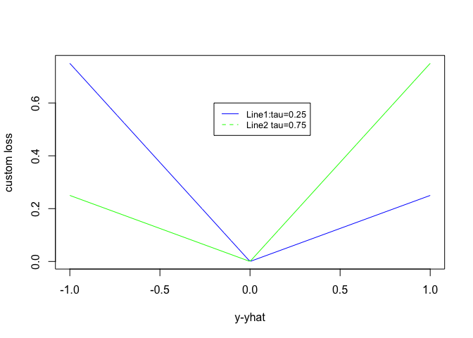
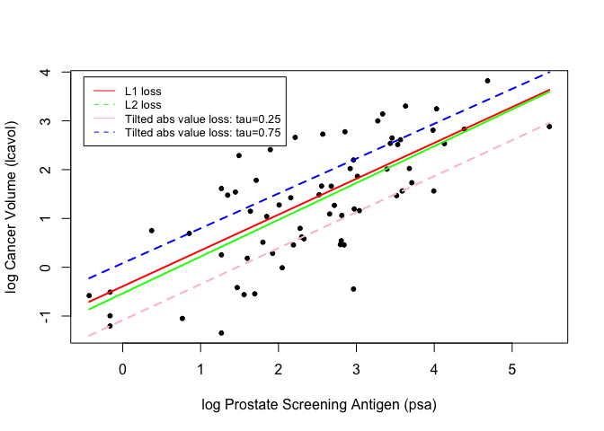
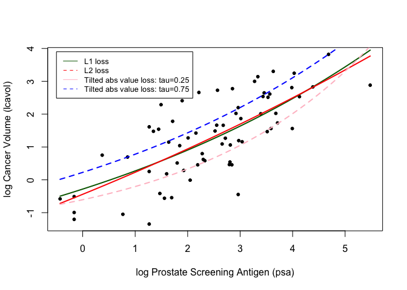

Homework2
================
Xueyuan Li
2023-01-19

``` r
## load prostate data
prostate <- 
  read.table(url(
    'https://web.stanford.edu/~hastie/ElemStatLearn/datasets/prostate.data'))

## subset to training examples
prostate_train <- subset(prostate, train==TRUE)

## plot lcavol vs lpsa
plot_psa_data <- function(dat=prostate_train) {
  plot(dat$lpsa, dat$lcavol,
       xlab="log Prostate Screening Antigen (psa)",
       ylab="log Cancer Volume (lcavol)",
       pch = 20)
}
plot_psa_data()
```

<!-- -->

## 1,Write functions that implement the L1 loss and tilted absolute loss functions.

``` r
# L1 loss function
L1_loss<- function(y,yhat)
  abs(y-yhat)

## L2 loss function
L2_loss <- function(y, yhat)
  (y-yhat)^2
```

``` r
# tilted absolute loss functions.
#install.packages("qrnn")
library("qrnn")

# tilted absolute value loss for tau = 0.25 
custom_loss_1 <- function(y, yhat)
  qrnn::tilted.abs(y-yhat,tau=0.25)

custom_loss_2 <- function(y, yhat)
  qrnn::tilted.abs(y-yhat,tau=0.75)
```

## 2,Create a figure that shows lpsa (x-axis) versus lcavol (y-axis). Add and label (using the ‘legend’ function) the linear model predictors associated with L2 loss, L1 loss, and tilted absolute value loss for tau = 0.25 and 0.75.

``` r
## fit simple linear model using numerical optimization
fit_lin_1 <- function(y, x, loss=L1_loss, beta_init = c(-0.51, 0.75)) {
  err <- function(beta)
    mean(loss(y,  beta[1] + beta[2]*x))
  beta <- optim(par = beta_init, fn = err)
  return(beta)
}

## fit simple linear model using numerical optimization
fit_lin_2 <- function(y, x, loss=L2_loss, beta_init = c(-0.51, 0.75)) {
  err <- function(beta)
    mean(loss(y,  beta[1] + beta[2]*x))
  beta <- optim(par = beta_init, fn = err)
  return(beta)
}

## make predictions from linear model
predict_lin <- function(x, beta)
  beta[1] + beta[2]*x
```

``` r
## fit linear model
lin_beta_1 <- fit_lin_1(y=prostate_train$lcavol,
                    x=prostate_train$lpsa,
                    loss=L1_loss)

lin_beta_2 <- fit_lin_1(y=prostate_train$lcavol,
                    x=prostate_train$lpsa,
                    loss=L2_loss)

## compute predictions for a grid of inputs
x_grid <- seq(min(prostate_train$lpsa),
              max(prostate_train$lpsa),
              length.out=100)


lin_pred_1 <- predict_lin(x=x_grid, beta=lin_beta_1$par)
lin_pred_2 <- predict_lin(x=x_grid, beta=lin_beta_2$par)
```

## Compare custom loss function when tau=0.25 and 0.75

``` r
#install.packages("qrnn")
library("qrnn")

# tilted absolute value loss for tau = 0.25 
custom_loss_1 <- function(y, yhat)
  qrnn::tilted.abs(y-yhat,tau=0.25)

custom_loss_2 <- function(y, yhat)
  qrnn::tilted.abs(y-yhat,tau=0.75)


## plot custom loss function
err_grd <- seq(-1,1,length.out=200)
plot(err_grd, custom_loss_1(err_grd,0), type='l',
     xlab='y-yhat', ylab='custom loss',col='blue')
lines(err_grd, custom_loss_2(err_grd,0), type='l',
     xlab='y-yhat', ylab='custom loss',col='green')

legend(-0.2, 0.6, legend=c("Line1:tau=0.25", "Line2 tau=0.75"),
       col=c("blue", "green"), lty=1:2, cex=0.8)
```

<!-- -->

``` r
## fit linear model with custom loss
lin_beta_custom_1 <- fit_lin_1(y=prostate_train$lcavol,
                    x=prostate_train$lpsa,
                    loss=custom_loss_1)

lin_beta_custom_2 <- fit_lin_2(y=prostate_train$lcavol,
                    x=prostate_train$lpsa,
                    loss=custom_loss_2)

lin_pred_custom_1 <- predict_lin(x=x_grid, beta=lin_beta_custom_1$par)
lin_pred_custom_2 <- predict_lin(x=x_grid, beta=lin_beta_custom_2$par)
## plot data
plot_psa_data()

## plot predictions from L1, L2 loss
lines(x=x_grid, y=lin_pred_1, col='red', lwd=2)
lines(x=x_grid, y=lin_pred_2, col='green', lwd=2)

## plot predictions from custom loss1, 2
lines(x=x_grid, y=lin_pred_custom_1, col='pink', lwd=2, lty=2)
lines(x=x_grid, y=lin_pred_custom_2, col='blue', lwd=2, lty=2)

legend(-0.5, 3.9, legend=c("L1 loss", "L2 loss","Tilted abs value loss: tau=0.25", "Tilted abs value loss: tau=0.75"),
       col=c("red", "green","pink", "blue"), lty=1:2, cex=0.8)
```

<!-- -->

## 3,Write functions to fit and predict from a simple nonlinear model with three parameters defined by ‘beta\[1\] + beta\[2\]*exp(-beta\[3\]*x)’. Hint: make copies of ‘fit_lin’ and ‘predict_lin’ and modify them to fit the nonlinear model. Use c(-1.0, 0.0, -0.3) as ‘beta_init’.

``` r
fit_lin_l1 <- function(y, x, loss=L1_loss, beta_init = c(-1.0, 0.0, -0.3)) {
  err <- function(beta)
    mean(loss(y, beta[1] + beta[2]*exp(-beta[3]*x)))
  beta <- optim(par = beta_init , fn = err)
  return(beta)
}


fit_lin_l2 <- function(y, x, loss=L2_loss, beta_init = c(-1.0, 0.0, -0.3)) {
  err <- function(beta)
    mean(loss(y, beta[1] + beta[2]*exp(-beta[3]*x)))
  beta <- optim(par = beta_init , fn = err)
  return(beta)
}

## make predictions from nonlinear model
predict_lin <- function(x, beta)
  beta[1] + beta[2]*exp(-beta[3]*x)
```

``` r
## fit nonlinear model
lin_beta_l1 <- fit_lin_l1(y=prostate_train$lcavol,
                    x=prostate_train$lpsa,
                    loss=L1_loss)

lin_beta_l2 <- fit_lin_l2(y=prostate_train$lcavol,
                    x=prostate_train$lpsa,
                    loss=L2_loss)

## compute predictions for a grid of inputs
x_grid <- seq(min(prostate_train$lpsa),
              max(prostate_train$lpsa),
              length.out=100)

lin_pred_l1 <- predict_lin(x=x_grid, beta=lin_beta_l1$par)
lin_pred_l2 <- predict_lin(x=x_grid, beta=lin_beta_l2$par)
```

## 4,Create a figure that shows lpsa (x-axis) versus lcavol (y-axis). Add and label (using the ‘legend’ function) the nonlinear model predictors associated with L2 loss, L1 loss, and tilted absolute value loss for tau = 0.25 and 0.75.

``` r
## fit linear model with custom loss
lin_beta_custom_1 <- fit_lin_l1(y=prostate_train$lcavol,
                    x=prostate_train$lpsa,
                    loss=custom_loss_1)
lin_beta_custom_2 <- fit_lin_l2(y=prostate_train$lcavol,
                    x=prostate_train$lpsa,
                    loss=custom_loss_2)
lin_pred_custom_1 <- predict_lin(x=x_grid, beta=lin_beta_custom_1$par)
lin_pred_custom_2 <- predict_lin(x=x_grid, beta=lin_beta_custom_2$par)

## plot data
plot_psa_data()

## plot predictions from L1, L2 loss
lines(x=x_grid, y=lin_pred_l1, col='darkgreen', lwd=2)
lines(x=x_grid, y=lin_pred_l2, col='red', lwd=2)

## plot predictions from custom loss1, 2
lines(x=x_grid, y=lin_pred_custom_1, col='pink', lwd=2, lty=2)
lines(x=x_grid, y=lin_pred_custom_2, col='blue', lwd=2, lty=2)

legend(-0.5, 3.9, legend=c("L1 loss", "L2 loss","Tilted abs value loss: tau=0.25", "Tilted abs value loss: tau=0.75"),
       col=c('darkgreen','red','pink', 'blue'), lty=1:2, cex=0.8)
```

<!-- -->
