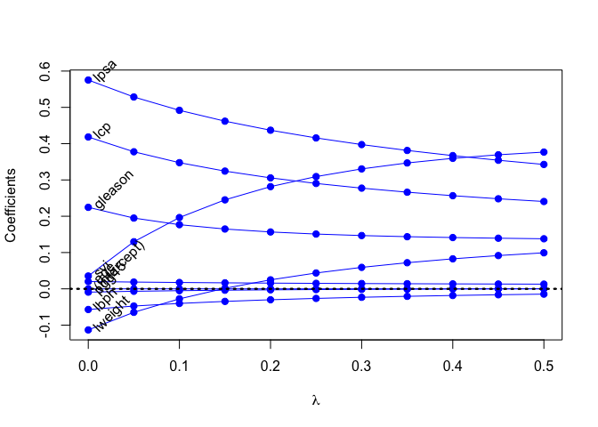

Homework03_mml
================
Xueyuan Li
2023-02-08

``` r
library('splines')        ## for 'bs'
library('scatterplot3d')  ## for 'scatterplot3d'
library('manipulate')     ## for 'manipulate'
library('beeswarm')
library('dplyr')          ## for 'select', 'filter', and others
```

    ## 
    ## Attaching package: 'dplyr'

    ## The following objects are masked from 'package:stats':
    ## 
    ##     filter, lag

    ## The following objects are masked from 'package:base':
    ## 
    ##     intersect, setdiff, setequal, union

``` r
library('magrittr')       ## for '%<>%' operator
library('glmnet')         ## for 'glmnet'
```

    ## Loading required package: Matrix

    ## Loaded glmnet 4.1-6

``` r
library(tidyverse)
```

    ## ── Attaching packages
    ## ───────────────────────────────────────
    ## tidyverse 1.3.2 ──

    ## ✔ ggplot2 3.3.6     ✔ purrr   0.3.4
    ## ✔ tibble  3.1.8     ✔ stringr 1.4.0
    ## ✔ tidyr   1.2.0     ✔ forcats 0.5.1
    ## ✔ readr   2.1.2     
    ## ── Conflicts ────────────────────────────────────────── tidyverse_conflicts() ──
    ## ✖ tidyr::expand()    masks Matrix::expand()
    ## ✖ tidyr::extract()   masks magrittr::extract()
    ## ✖ dplyr::filter()    masks stats::filter()
    ## ✖ dplyr::lag()       masks stats::lag()
    ## ✖ tidyr::pack()      masks Matrix::pack()
    ## ✖ purrr::set_names() masks magrittr::set_names()
    ## ✖ tidyr::unpack()    masks Matrix::unpack()

Using the RMarkdown/knitr/github mechanism, implement the following
tasks:

### (1) Use the prostate cancer data.

``` r
prostate <- 
  read.table(url(
    'https://web.stanford.edu/~hastie/ElemStatLearn/datasets/prostate.data'))

pairs(prostate)
```

<!-- -->

### (2) Use the cor function to reproduce the correlations listed in HTF Table 3.1, page 50.

``` r
y <- select(prostate, lcavol,lweight,age,lbph,svi, lcp, gleason)
x<- select (prostate, lweight, age, lbph, svi, lcp, gleason, pgg45)
table<-round(cor(x,y, method = "kendall", use = "all.obs"),digits=3)
table[1,2:7]<-""
table[2,3:7]<-""
table[3,4:7]<-""
table[4,5:7]<-""
table[5,6:7]<-""
table[6,7:7]<-""
df<-data.frame(table)
df
```

    ##         lcavol lweight   age   lbph   svi   lcp gleason
    ## lweight  0.194                                         
    ## age      0.124   0.286                                 
    ## lbph      0.01   0.388 0.252                           
    ## svi      0.458   0.144 0.108 -0.079                    
    ## lcp      0.534   0.133 0.112  0.013 0.548              
    ## gleason  0.391   0.116 0.206  0.091 0.367 0.506        
    ## pgg45    0.369   0.115 0.196  0.073  0.42 0.525   0.769

### (3) Treat lcavol as the outcome, and use all other variables in the data set as predictors.

``` r
## split prostate into testing and training subsets
prostate_train <- prostate %>%
  filter(train == TRUE) %>% 
  select(-train)

prostate_test <- prostate %>%
  filter(train == FALSE) %>% 
  select(-train)

x_train <- prostate_train %>%
  select(-lcavol)

x_test  <- prostate_test %>%
  select(-lcavol)


## principal components analysis
pca_x_train <- princomp(x_train, cor = T)

# pca loadings -- define linear combinations of X needed to calcluate each Z
pca_x_train$loadings
```

    ## 
    ## Loadings:
    ##         Comp.1 Comp.2 Comp.3 Comp.4 Comp.5 Comp.6 Comp.7 Comp.8
    ## lweight  0.214  0.554  0.289  0.149  0.635  0.303  0.214       
    ## age      0.250  0.321 -0.496  0.712 -0.197 -0.109 -0.168       
    ## lbph            0.626 -0.134 -0.490 -0.536  0.187  0.148       
    ## svi      0.399 -0.189  0.429  0.263 -0.377 -0.124  0.625       
    ## lcp      0.442 -0.223  0.175        -0.193  0.618 -0.443  0.328
    ## gleason  0.395 -0.153 -0.507 -0.256  0.246 -0.160  0.330  0.550
    ## pgg45    0.453 -0.217 -0.256 -0.242  0.173  0.122        -0.761
    ## lpsa     0.412  0.206  0.340 -0.194        -0.651 -0.455       
    ## 
    ##                Comp.1 Comp.2 Comp.3 Comp.4 Comp.5 Comp.6 Comp.7 Comp.8
    ## SS loadings     1.000  1.000  1.000  1.000  1.000  1.000  1.000  1.000
    ## Proportion Var  0.125  0.125  0.125  0.125  0.125  0.125  0.125  0.125
    ## Cumulative Var  0.125  0.250  0.375  0.500  0.625  0.750  0.875  1.000

``` r
# transform X into Z (principal components)   -> y (prediction)
# each row/observation has 8 predictors, X, which are transformed (matrix multiplied) by the loading factors
z_train <- pca_x_train$scores # dim(X) = dim(Z) = 67 x 8
```

``` r
## predict lcavol using all PCs
yz_train <- data.frame(lcavol=prostate_train$lcavol, # outcome
                       z_train) # PCs from training set
yz_test  <- data.frame(lcavol=prostate_test$lcavol, # outcome
                       predict(pca_x_train, x_test)) # get PCs on testing set by using the same rotation as on the training set
fit <- lm(lcavol ~ ., data=yz_train) # regress outcome on PCs using training data to estimate coefficients for each PC
summary(fit) # components 1,2,8 have relatively large positive associations, component 7 has a negative association
```

    ## 
    ## Call:
    ## lm(formula = lcavol ~ ., data = yz_train)
    ## 
    ## Residuals:
    ##      Min       1Q   Median       3Q      Max 
    ## -1.71027 -0.50138  0.03103  0.51352  1.35376 
    ## 
    ## Coefficients:
    ##              Estimate Std. Error t value Pr(>|t|)    
    ## (Intercept)  1.313492   0.086937  15.108  < 2e-16 ***
    ## Comp.1       0.509669   0.047699  10.685 2.51e-15 ***
    ## Comp.2       0.009466   0.066739   0.142  0.88770    
    ## Comp.3       0.251766   0.083596   3.012  0.00384 ** 
    ## Comp.4       0.050922   0.109018   0.467  0.64218    
    ## Comp.5      -0.119169   0.131874  -0.904  0.36992    
    ## Comp.6      -0.196830   0.141444  -1.392  0.16936    
    ## Comp.7      -0.552757   0.171634  -3.221  0.00210 ** 
    ## Comp.8       0.507443   0.197058   2.575  0.01259 *  
    ## ---
    ## Signif. codes:  0 '***' 0.001 '**' 0.01 '*' 0.05 '.' 0.1 ' ' 1
    ## 
    ## Residual standard error: 0.7116 on 58 degrees of freedom
    ## Multiple R-squared:  0.7118, Adjusted R-squared:  0.672 
    ## F-statistic:  17.9 on 8 and 58 DF,  p-value: 3.999e-13

### (4) With the training subset of the prostate data, train a least-squares regression model with all predictors using the lm function.

``` r
pcr_fits <- lapply(8:0, function(nPC)
  lm(lcavol ~ ., data=yz_train %>% select(c(1+0:nPC))))
```

### (5) Use the testing subset to compute the test error (average squared-error loss) using the fitted least-squares regression model.

``` r
## functions to compute testing/training error w/lm
L2_loss <- function(y, yhat)
  (y-yhat)^2

## functions to compute testing/training error with lm
error <- function(dat, fit, loss=L2_loss) {
  y_hat <- predict(fit, newdata=dat)
  mean(loss(dat$lcavol, y_hat))
}

## train_error 
error(yz_train, fit)
```

    ## [1] 0.4383709

``` r
## testing error 
error(yz_test, fit)
```

    ## [1] 0.5084068

### (6) Train a ridge regression model using the glmnet function, and tune the value of lambda (i.e., use guess and check to find the value of lambda that approximately minimizes the test error).

``` r
## use lasso in combination with linear splines for 
## lweight, age, lpbh, lcp, pgg45, and lpsa
## use linear splines with 2 knots

form  <- lcavol ~  lweight + age + lbph + lcp + pgg45 + lpsa + svi + gleason
x_inp <- model.matrix(form, data=prostate_train)
y_out <- prostate_train$lcavol
ridge_model <- glmnet(x=x_inp, y=y_out, lambda=seq(0.5, 0, -0.05), alpha = 0)
print(ridge_model$beta)
```

    ## 9 x 11 sparse Matrix of class "dgCMatrix"

    ##    [[ suppressing 11 column names 's0', 's1', 's2' ... ]]

    ##                                                                    
    ## (Intercept)  .             .             .             .           
    ## lweight      0.0993164708  9.167566e-02  0.0826683948  0.0719539791
    ## age          0.0129153943  1.324527e-02  0.0136179441  0.0140406458
    ## lbph        -0.0145798645 -1.634009e-02 -0.0183250211 -0.0206075810
    ## lcp          0.2406189663  2.481045e-01  0.2566365965  0.2662889674
    ## pgg45        0.0002559092 -6.282802e-05 -0.0004352183 -0.0008738898
    ## lpsa         0.3427088262  3.542773e-01  0.3670625828  0.3813402190
    ## svi          0.3767521726  3.693591e-01  0.3595330020  0.3468674180
    ## gleason      0.1379543516  1.394770e-01  0.1413173561  0.1436779615
    ##                                                                             
    ## (Intercept)  .            .            .            .            .          
    ## lweight      0.059127616  0.043652593  0.024777969  0.001504802 -0.027603986
    ## age          0.014526957  0.015088490  0.015748487  0.016532948  0.017480107
    ## lbph        -0.023258103 -0.026377963 -0.030098852 -0.034621150 -0.040241264
    ## lcp          0.277447149  0.290342311  0.305728439  0.324372008  0.347616547
    ## pgg45       -0.001398912 -0.002031353 -0.002810371 -0.003788173 -0.005050263
    ## lpsa         0.397429712  0.415786556  0.437009864  0.461951799  0.491849702
    ## svi          0.330415198  0.309283880  0.281608260  0.245177911  0.196427346
    ## gleason      0.146778188  0.150949425  0.156678907  0.164800413  0.176722769
    ##                                      
    ## (Intercept)  .            .          
    ## lweight     -0.064680201 -0.113137304
    ## age          0.018643148  0.020098181
    ## lbph        -0.047425776 -0.056962692
    ## lcp          0.377657417  0.418431830
    ## pgg45       -0.006739814 -0.009116838
    ## lpsa         0.528596455  0.575318051
    ## svi          0.129711598  0.035342349
    ## gleason      0.194999807  0.224585243

``` r
#ridge_model <- glmnet(x = as.matrix(train[, -10]), y = train$lpsa, alpha = 0)
#cv <- cv.glmnet(x=x_inp, y=y_out, lambda=seq(0.5, 0, -0.05))
#lambda_min <- cv$lambda.min
```

### (7) Create a figure that shows the training and test error associated with ridge regression as a function of lambda

``` r
## functions to compute testing/training error with glmnet
error <- function(dat, ridge_model, lam, form, loss=L2_loss) {
  x_inp <- model.matrix(form, data=dat)
  y_out <- dat$lcavol
  y_hat <- predict(ridge_model, newx=x_inp, s=lam)  ## see predict.elnet
  mean(loss(y_out, y_hat))
}

## compute training and testing errors as function of lambda
err_train_1 <- sapply(ridge_model$lambda, function(lam) 
  error(prostate_train, ridge_model, lam, form))
err_test_1 <- sapply(ridge_model$lambda, function(lam) 
  error(prostate_test, ridge_model, lam, form))

## plot test/train error
plot(x=range(ridge_model$lambda),
     y=range(c(err_train_1, err_test_1)),
     xlim=rev(range(ridge_model$lambda)),
     type='n',
     xlab=expression(lambda),
     ylab='train/test error')
points(ridge_model$lambda, err_train_1, pch=19, type='b', col='darkblue')
points(ridge_model$lambda, err_test_1, pch=19, type='b', col='darkred')
legend('topright', c('train','test'), lty=1, pch=19,
       col=c('darkblue','darkred'), bty='n')
```

<!-- -->

``` r
colnames(ridge_model$beta) <- paste('lam =', ridge_model$lambda)
print(ridge_model$beta %>% as.matrix)
```

    ##                 lam = 0.5    lam = 0.45     lam = 0.4    lam = 0.35
    ## (Intercept)  0.0000000000  0.000000e+00  0.0000000000  0.0000000000
    ## lweight      0.0993164708  9.167566e-02  0.0826683948  0.0719539791
    ## age          0.0129153943  1.324527e-02  0.0136179441  0.0140406458
    ## lbph        -0.0145798645 -1.634009e-02 -0.0183250211 -0.0206075810
    ## lcp          0.2406189663  2.481045e-01  0.2566365965  0.2662889674
    ## pgg45        0.0002559092 -6.282802e-05 -0.0004352183 -0.0008738898
    ## lpsa         0.3427088262  3.542773e-01  0.3670625828  0.3813402190
    ## svi          0.3767521726  3.693591e-01  0.3595330020  0.3468674180
    ## gleason      0.1379543516  1.394770e-01  0.1413173561  0.1436779615
    ##                lam = 0.3   lam = 0.25    lam = 0.2   lam = 0.15    lam = 0.1
    ## (Intercept)  0.000000000  0.000000000  0.000000000  0.000000000  0.000000000
    ## lweight      0.059127616  0.043652593  0.024777969  0.001504802 -0.027603986
    ## age          0.014526957  0.015088490  0.015748487  0.016532948  0.017480107
    ## lbph        -0.023258103 -0.026377963 -0.030098852 -0.034621150 -0.040241264
    ## lcp          0.277447149  0.290342311  0.305728439  0.324372008  0.347616547
    ## pgg45       -0.001398912 -0.002031353 -0.002810371 -0.003788173 -0.005050263
    ## lpsa         0.397429712  0.415786556  0.437009864  0.461951799  0.491849702
    ## svi          0.330415198  0.309283880  0.281608260  0.245177911  0.196427346
    ## gleason      0.146778188  0.150949425  0.156678907  0.164800413  0.176722769
    ##               lam = 0.05      lam = 0
    ## (Intercept)  0.000000000  0.000000000
    ## lweight     -0.064680201 -0.113137304
    ## age          0.018643148  0.020098181
    ## lbph        -0.047425776 -0.056962692
    ## lcp          0.377657417  0.418431830
    ## pgg45       -0.006739814 -0.009116838
    ## lpsa         0.528596455  0.575318051
    ## svi          0.129711598  0.035342349
    ## gleason      0.194999807  0.224585243

### (8) Create a path diagram of the ridge regression analysis, similar to HTF Figure 3.8

``` r
## plot path diagram
plot(x=range(ridge_model$lambda),
     y=range(as.matrix(ridge_model$beta)),
     type='n',
     xlab=expression(lambda),
     ylab='Coefficients')
for(i in 1:nrow(ridge_model$beta)) {
  points(x=ridge_model$lambda, y=ridge_model$beta[i,], pch=19, col='blue')
  lines(x=ridge_model$lambda, y=ridge_model$beta[i,], col='blue')
}
abline(h=0, lty=3, lwd=2)
text(x=0, y=ridge_model$beta[,ncol(ridge_model$beta)], 
     labels=rownames(ridge_model$beta),
     xpd=NA, pos=4, srt=45)
abline(h=0, lty=3, lwd=2)
```

<!-- -->
