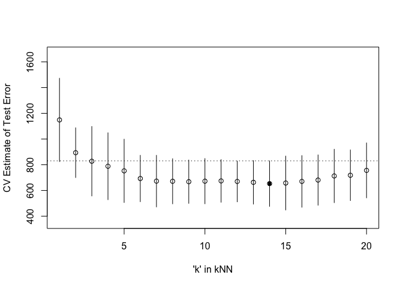

homework4
================
Xueyuan Li
2023-02-22

``` r
library('MASS') ## for 'mcycle'
library('manipulate') ## for 'manipulate'
library('caret') ## 'knnreg' and 'createFolds'
```

    ## Loading required package: ggplot2

    ## Loading required package: lattice

``` r
library('ggplot2')
```

Goal: Understand and implement various ways to approximate test error.
In the ISLR book, read section 6.1.3 “Choosing the Optimal Model” and
section 5.1 “Cross-Validation”. Extend and convert the attached
effective-df-aic-bic-mcycle.R R script into an R markdown file that
accomplishes the following tasks.

### 1,Randomly split the mcycle data into training (75%) and validation (25%) subsets.

``` r
require(caTools)
```

    ## Loading required package: caTools

``` r
set.seed(101) 
sample_y = sample.split(mcycle$accel, SplitRatio = .75)
train_y = subset(mcycle$accel, sample_y == TRUE)
val_y  = subset(mcycle$accel, sample_y == FALSE)
```

``` r
sample_x = sample.split(mcycle$times, SplitRatio = .75)
train_x = subset(mcycle$times, sample_x == TRUE)
val_x  = subset(mcycle$times, sample_x == FALSE)

train_x=matrix(train_x) 
train_y=matrix(train_y)
val_x=matrix(val_x)
val_y=matrix(val_y)
```

### 2, Using the mcycle data, consider predicting the mean acceleration as a function of time. Use the Nadaraya-Watson method with the k-NN kernel function to create a series of prediction models by varying the tuning parameter over a sequence of values. (hint: the script already implements this)

``` r
## Epanechnikov kernel function
## x  - n x p matrix of training inputs
## x0 - 1 x p input where to make prediction
## lambda - bandwidth (neighborhood size)
kernel_epanechnikov <- function(x, x0, lambda=1) {
  d <- function(t)
    ifelse(t <= 1, 3/4*(1-t^2), 0)
  z <- t(t(x) - x0)
  d(sqrt(rowSums(z*z))/lambda)
}

## k-NN kernel function
## x  - n x p matrix of training inputs
## x0 - 1 x p input where to make prediction
## k  - number of nearest neighbors
kernel_k_nearest_neighbors <- function(x, x0, knn=1) {
  ## compute distance betwen each x and x0
  z <- t(t(x) - x0)
  d <- sqrt(rowSums(z*z))

  ## initialize kernel weights to zero
  w <- rep(0, length(d))
  
  ## set weight to 1 for k nearest neighbors
  w[order(d)[1:knn]] <- 1
  
  return(w)
}

## Make predictions using the NW method
## y  - n x 1 vector of training outputs
## x  - n x p matrix of training inputs
## x0 - m x p matrix where to make predictions
## kern  - kernel function to use
## ... - arguments to pass to kernel function
nadaraya_watson <- function(y, x, x0, kern, ...) {
  k <- t(apply(x0, 1, function(x0_) {
    k_<- kern(x, x0_, ...)
    k_/sum(k_)
  }))
  yhat <- drop(k %*% y)
  attr(yhat, 'k') <- k
  return(yhat)
}

## Helper function to view kernel (smoother) matrix
matrix_image <- function(x) {
  rot <- function(x) t(apply(x, 2, rev))
  cls <- rev(gray.colors(20, end=1))
  image(rot(x), col=cls, axes=FALSE)
  xlb <- pretty(1:ncol(x))
  xat <- (xlb-0.5)/ncol(x)
  ylb <- pretty(1:nrow(x))
  yat <- (ylb-0.5)/nrow(x)
  axis(3, at=xat, labels=xlb)
  axis(2, at=yat, labels=ylb)
  mtext('Rows', 2, 3)
  mtext('Columns', 3, 3)
}

## Compute effective df using NW method
## y  - n x 1 vector of training outputs
## x  - n x p matrix of training inputs
## kern  - kernel function to use
## ... - arguments to pass to kernel function
effective_df <- function(y, x, kern, ...) {
  y_hat <- nadaraya_watson(y, x, x,
    kern=kern, ...)
  sum(diag(attr(y_hat, 'k')))
}

## loss function
## y    - train/test y
## yhat - predictions at train/test x
loss_squared_error <- function(y, yhat)
  (y - yhat)^2

## test/train error
## y    - train/test y
## yhat - predictions at train/test x
## loss - loss function
error <- function(y, yhat, loss=loss_squared_error)
  mean(loss(y, yhat))

## AIC
## y    - training y
## yhat - predictions at training x
## d    - effective degrees of freedom
aic <- function(y, yhat, d)
  error(y, yhat) + 2/length(y)*d

## BIC
## y    - training y
## yhat - predictions at training x
## d    - effective degrees of freedom
bic <- function(y, yhat, d)
  error(y, yhat) + log(length(y))/length(y)*d


## make predictions using NW method at training inputs
y_hat <- nadaraya_watson(train_y, train_x, train_x,
  kernel_epanechnikov, lambda=5)

## view kernel (smoother) matrix
matrix_image(attr(y_hat, 'k'))
```

<!-- -->

``` r
## compute effective degrees of freedom
edf <- effective_df(train_y, train_x, kernel_epanechnikov, lambda=5)
edf 
```

    ## [1] 8.488742

``` r
plot(train_x,train_y, xlab="Time (ms)", ylab="Acceleration (g)")
lines(train_x, y_hat, col="#882255", lwd=2) 
```

<!-- -->

``` r
AIC<-aic(train_y,y_hat,edf)
BIC<-bic(train_y,y_hat,edf)

AIC
```

    ## [1] 755.2282

``` r
BIC
```

    ## [1] 755.4507

### 3, With the squared-error loss function, compute and plot the training error, AIC, BIC, and validation error (using the validation data) as functions of the tuning parameter.

``` r
# Create a sequence of tuning parameters
k <- seq(1, 20, by = 1)
length(k)
```

    ## [1] 20

``` r
train_error<-matrix(0, nrow = length(k), ncol = 1)
val_error<- matrix(0, nrow = length(k), ncol = 1)
AIC <- matrix(0, nrow = length(k), ncol = 1)
BIC<- matrix(0, nrow = length(k), ncol = 1)
train=data.frame(train_x,train_y)
val=data.frame(val_x, val_y)


for (i in 1:20) {
  i
  y_hat_train <-nadaraya_watson(train_y, train_x, train_x, kernel_k_nearest_neighbors,knn=i)
  y_hat_val <- nadaraya_watson(val_y, val_x, val_x, kernel_k_nearest_neighbors, knn=i)

  # Calculate the training error
  train_error[i] <- error(train_y, y_hat_train ,loss=loss_squared_error)
  
  # Calculate the validation error
  val_error[i] <- error(val_y, y_hat_val, loss=loss_squared_error)
  
  
  #d <- effective_df(train_y,train_x, tuning_seq[i])
  #train_edf <- effective_df(train_y,train_x, kernel_epanechnikov, lambda=5)
  AIC[i] <- aic(train_y, y_hat_train , edf)
  BIC[i] <- bic(train_y, y_hat_train , edf)

}


train_error
```

    ##           [,1]
    ##  [1,] 345.6334
    ##  [2,] 392.9843
    ##  [3,] 437.3880
    ##  [4,] 418.0939
    ##  [5,] 466.8422
    ##  [6,] 501.8771
    ##  [7,] 487.9411
    ##  [8,] 526.8563
    ##  [9,] 522.7323
    ## [10,] 547.1536
    ## [11,] 579.3459
    ## [12,] 596.4946
    ## [13,] 613.0311
    ## [14,] 640.7476
    ## [15,] 664.0323
    ## [16,] 695.7529
    ## [17,] 737.2865
    ## [18,] 768.6450
    ## [19,] 788.7817
    ## [20,] 807.1488

``` r
val_error
```

    ##             [,1]
    ##  [1,]   85.51912
    ##  [2,]  188.29154
    ##  [3,]  269.55807
    ##  [4,]  410.01960
    ##  [5,]  437.06745
    ##  [6,]  456.82947
    ##  [7,]  488.62010
    ##  [8,]  642.71806
    ##  [9,]  760.78768
    ## [10,]  913.40619
    ## [11,] 1085.86210
    ## [12,] 1240.00547
    ## [13,] 1318.71837
    ## [14,] 1462.80844
    ## [15,] 1508.10835
    ## [16,] 1594.24014
    ## [17,] 1751.32587
    ## [18,] 1875.62332
    ## [19,] 1996.73545
    ## [20,] 2082.83329

``` r
AIC
```

    ##           [,1]
    ##  [1,] 345.8049
    ##  [2,] 393.1558
    ##  [3,] 437.5595
    ##  [4,] 418.2654
    ##  [5,] 467.0137
    ##  [6,] 502.0486
    ##  [7,] 488.1126
    ##  [8,] 527.0278
    ##  [9,] 522.9038
    ## [10,] 547.3251
    ## [11,] 579.5174
    ## [12,] 596.6661
    ## [13,] 613.2026
    ## [14,] 640.9191
    ## [15,] 664.2038
    ## [16,] 695.9244
    ## [17,] 737.4580
    ## [18,] 768.8165
    ## [19,] 788.9531
    ## [20,] 807.3203

``` r
BIC
```

    ##           [,1]
    ##  [1,] 346.0274
    ##  [2,] 393.3783
    ##  [3,] 437.7820
    ##  [4,] 418.4879
    ##  [5,] 467.2362
    ##  [6,] 502.2711
    ##  [7,] 488.3351
    ##  [8,] 527.2503
    ##  [9,] 523.1263
    ## [10,] 547.5476
    ## [11,] 579.7399
    ## [12,] 596.8886
    ## [13,] 613.4251
    ## [14,] 641.1417
    ## [15,] 664.4263
    ## [16,] 696.1469
    ## [17,] 737.6805
    ## [18,] 769.0390
    ## [19,] 789.1757
    ## [20,] 807.5429

``` r
# Plot the errors as a function of the tuning parameter
par(mfrow = c(2, 2))
plot(k, train_error, type = "l", xlab = "Tuning Parameter", ylab = "Training Error")
#abline(v = tuning_seq[which.min(train_error)], lty = 2)
plot(k, AIC, type = "l", xlab = "Tuning Parameter", ylab = "AIC")
#abline(v = tuning_seq[which.min(AIC)], lty = 2)
plot(k, BIC, type = "l", xlab = "Tuning Parameter", ylab = "BIC")
#abline(v = tuning_seq[which.min(BIC)], lty = 2)
plot(k,val_error, type = "l", xlab = "Tuning Parameter", ylab = "Validation Error")
```

<!-- -->

``` r
#abline(v = tuning_seq[which.min(val_error)], lty = 2)
```

### 4, For each value of the tuning parameter, Perform 5-fold cross-validation using the combined training and validation data. This results in 5 estimates of test error per tuning parameter value.

``` r
## 5-fold cross-validation of knnreg model
## create five folds
set.seed(1985)
inc_flds  <- createFolds(mcycle$accel, k=5)
print(inc_flds)
```

    ## $Fold1
    ##  [1]   8  21  25  26  28  31  35  39  41  42  65  69  71  73  77  80  88  98 101
    ## [20] 102 108 109 116 128 129 130
    ## 
    ## $Fold2
    ##  [1]  11  12  15  16  17  23  32  44  47  49  51  55  57  68  75  79  82  90  92
    ## [20]  99 107 110 113 117 119 121 123 125
    ## 
    ## $Fold3
    ##  [1]   2  10  18  19  34  36  38  45  46  50  54  58  63  64  81  84  85  86  87
    ## [20]  89  93  97 115 118 124 132
    ## 
    ## $Fold4
    ##  [1]   3   6   7  14  20  24  27  29  33  40  43  48  56  59  60  66  74  78  91
    ## [20]  94  96 104 106 122 126 127 131
    ## 
    ## $Fold5
    ##  [1]   1   4   5   9  13  22  30  37  52  53  61  62  67  70  72  76  83  95 100
    ## [20] 103 105 111 112 114 120 133

``` r
sapply(inc_flds, length)  ## not all the same length
```

    ## Fold1 Fold2 Fold3 Fold4 Fold5 
    ##    26    28    26    27    26

``` r
cvknnreg <- function(kNN = 10, flds=inc_flds) {
  cverr <- rep(NA, length(flds))
  for(tst_idx in 1:length(flds)) { ## for each fold
    
    ## get training and testing data
    #train=data.frame(train_x,train_y)
    #val=data.frame(val_x, val_y)
    #inc_trn <- train
    #inc_tst <- val
    
    ## get training and testing data
    inc_trn <- mcycle[-flds[[tst_idx]],]
    inc_tst <- mcycle[ flds[[tst_idx]],]
    
    ## fit kNN model to training data
    knn_fit <- knnreg(accel ~ times, k=kNN, data=inc_trn)
    
    ## compute test error on testing data
    pre_tst <- predict(knn_fit, inc_tst)
    
    cverr[tst_idx] <- mean((inc_tst$accel - pre_tst)^2)
    
  }
  
  return(cverr)
}

cverrs <- sapply(1:20, cvknnreg)
print(cverrs) 
```

    ##           [,1]      [,2]      [,3]      [,4]      [,5]     [,6]     [,7]
    ## [1,] 1662.9777 1200.0656 1140.7323 1139.9682 1072.4565 871.8225 902.6736
    ## [2,] 1233.9254  719.7545  414.6529  406.2720  392.1644 388.9737 356.7845
    ## [3,]  950.2992  743.4935  767.2904  790.7059  837.1636 746.2646 699.6566
    ## [4,] 1066.6833  939.3517  966.4693  819.2197  762.0736 739.3821 755.9211
    ## [5,]  829.5536  866.2058  847.8847  786.1484  698.5016 718.3772 647.9664
    ##          [,8]     [,9]    [,10]    [,11]    [,12]    [,13]    [,14]    [,15]
    ## [1,] 865.9440 881.9663 905.4154 918.8290 879.4212 870.7356 893.7753 948.6905
    ## [2,] 398.2982 437.8430 435.3835 468.2931 458.9995 420.2574 406.9754 374.1702
    ## [3,] 665.1589 684.4300 707.7291 699.0208 723.3589 726.6567 696.9062 714.1368
    ## [4,] 773.0690 753.5173 732.2657 693.2659 707.9107 712.3221 680.9196 676.9464
    ## [5,] 654.7812 582.7061 580.6095 591.8443 580.9938 586.1192 588.1546 575.1274
    ##         [,16]    [,17]    [,18]    [,19]    [,20]
    ## [1,] 923.3845 940.7557 996.8310 952.1598 965.4597
    ## [2,] 382.4026 405.5556 419.2063 417.0465 417.9231
    ## [3,] 767.9444 755.3994 754.1490 781.4413 868.3828
    ## [4,] 678.1938 684.7731 737.2583 773.9589 840.3452
    ## [5,] 600.3366 618.1128 656.5049 666.6291 688.6101

``` r
cverrs_mean <- apply(cverrs, 2, mean)
cverrs_sd   <- apply(cverrs, 2, sd)

cverrs_mean
```

    ##  [1] 1148.6878  893.7742  827.4059  788.4628  752.4719  692.9640  672.6004
    ##  [8]  671.4503  668.0925  672.2806  674.2506  670.1368  663.2182  653.3462
    ## [15]  657.8143  670.4524  680.9193  712.7899  718.2471  756.1442

``` r
cverrs_sd 
```

    ##  [1] 323.9170 193.3384 270.1437 260.0876 246.1653 180.3066 200.5957 175.4164
    ##  [9] 168.5319 175.8767 165.8335 158.5756 169.1695 177.0681 209.4268 200.8906
    ## [17] 195.4782 207.5741 196.9763 213.5736

``` r
## Plot the results of 5-fold CV for kNN = 1:20
plot(x=1:20, y=cverrs_mean, 
     ylim=range(cverrs),
     xlab="'k' in kNN", ylab="CV Estimate of Test Error")
segments(x0=1:20, x1=1:20,
         y0=cverrs_mean-cverrs_sd,
         y1=cverrs_mean+cverrs_sd,ylim=range(cverrs))
best_idx <- which.min(cverrs_mean)
points(x=best_idx, y=cverrs_mean[best_idx], pch=20)
abline(h=cverrs_mean[best_idx] + cverrs_sd[best_idx], lty=3)
```

<!-- -->

### 5, Plot the CV-estimated test error (average of the five estimates from each fold) as a function of the tuning parameter. Add vertical line segments to the figure (using the segments function in R) that represent one “standard error” of the CV-estimated test error (standard deviation of the five estimates from each fold).

``` r
## Plot the results of 5-fold CV for kNN = 1:20
plot(x=1:20, y=cverrs_mean, 
     ylim=range(cverrs),
     xlab="'k' in kNN", ylab="CV Estimate of Test Error")
segments(x0=1:20, x1=1:20,
         y0=cverrs_mean-cverrs_sd,
         y1=cverrs_mean+cverrs_sd,ylim=range(cverrs))
best_idx <- which.min(cverrs_mean)
points(x=best_idx, y=cverrs_mean[best_idx], pch=20)
abline(h=cverrs_mean[best_idx] + cverrs_sd[best_idx], lty=3)
```

<!-- -->

### 6, Interpret the resulting figures and select a suitable value for the tuning parameter.

The resulting figure shows the CV-estimated test error as a function of
the tuning parameter for the k-nearest neighbor regression model. The
y-axis represents the mean CV-estimated test error, and the x-axis
represents the values of the tuning parameter (k).

The figure also includes vertical line segments that represent one
standard error of the CV-estimated test error. These segments give an
indication of the variability of the CV-estimated test error across the
different folds.

To select a suitable value for the tuning parameter, we look for the
value of k=14 that has the lowest CV-estimated test error. In the
figure, this corresponds to the point with the lowest y-value.
Additionally, we want to choose a value of k that is not too high, as
this could result in overfitting, nor too low, as this could result in
underfitting.

To select a suitable value for the tuning parameter, we look for the
value of k that has the lowest CV-estimated test error. In the figure,
this corresponds to the point with the lowest y-value. Additionally, we
want to choose a value of k that is not too high, as this could result
in overfitting, nor too low, as this could result in underfitting.
